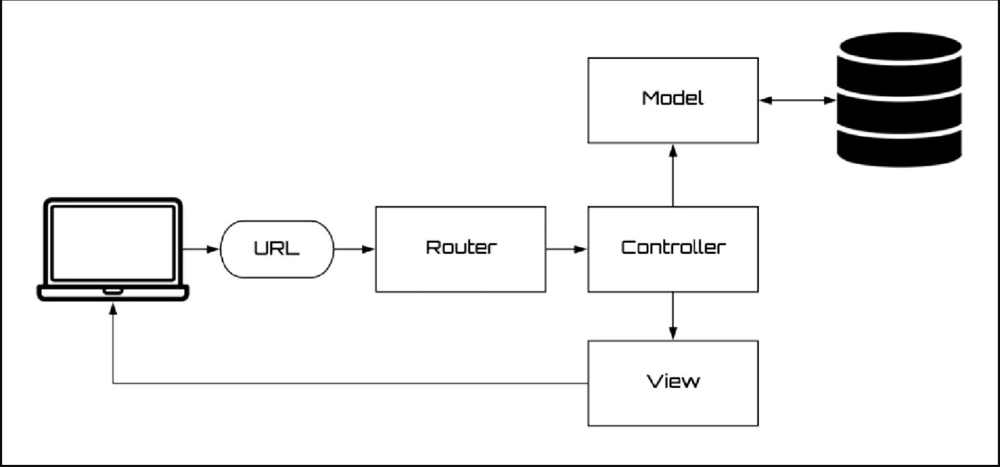

# Beginner 2

## MVC

- 

## The View Layer

- Setup Route first
- [#setup-route](./bg1.md/#setup-route)

### Blade template syntax

#### If Statements

```php
// In web.php
Route::get('/number/{num}', function ($num) {
  return view('view', ['num' => $num]);
});

// In view.blade.php file
@if ($num == 1)
<p>The number is one.</p>
@elseif ($num == 2)
<p>The number is two.</p>
@else
<p>The number is three.</p>
@endif
```

#### Switch Statements

```php
@switch($i)
  @case(1)
    First case. . .
    @break
  @case(2)
    Second case. . .
    @break
  @default
    Default case. . .
@endswitch
```

#### Loops

```php
// condition loop
@for ($i = 0; $i < 10; $i++)
  The current value is {{ $i }}
@endfor

// loop each item
@foreach ($users as $user)
<p>This is user {{ $user->id }}</p>
@endforeach

// while
@while (true)
<p>I am looping forever.</p>
@endwhile


// Loop and condition together
@foreach ($users as $user)
  @if ($loop->first)
  <p>This is the first iteration.</p>
  @endif

  <p>This is user {{ $user->id }}</p>
@endforeach
```

#### Condition class

```php
<span @class([
    'p-4',
    'font-bold' => $isActive,
    'bg-red' => $hasError,
])></span>
```

### Building the layout

#### Template Inheritance

- Create `home.blade.php` router

```php
Route::get('/', function () {
    return view('home');
});
```

```php
@extends('layout')

@section('title')
<title>Home Page</title>
@endsection

@section('content')
<p>Lorem ipsum dolor sit amet, consectetur adipiscing elit. . .</p>

@include('sidebar')
@endsection
```

> We can create `sidebar.blade.php` and include to home

- Create `layout.blade.php`

```php
<html>
  <head>
    @yield('title')
  </head>

  <body>
    <div class="container">@yield('content')</div>
  </body>
</html>
```

#### Components

> The component system in Laravel is actually a lot similar to the one in Vue.js, so if you followed the course on Vue components, this shouldn’t be too hard.

- Create folder `components`
- Create file `views/components/layout.blade.php`

```php
<html>
  <head>
    {{ $title }}
  </head>

  <body>
    <div class="container">{{ $slot }}</div>
  </body>
</html>
```

- Inside `views/home.blade.php`

```php
<x-layout>
  // name="title" will be assigned to $title
  <x-slot name="title">
    <title>Home Page</title>
  </x-slot>

  <p>
    Lorem ipsum dolor sit amet, consectetur adipiscing elit. Vestibulum eu elit
    semper ex varius vehicula.
  </p>
</x-layout>
```

> `x-layout` automatically be assigned to `$slot`

## Dealing with database

- Check variables in file `.env`

```sh
# Example
DB_CONNECTION=mysql
DB_HOST=mysql
DB_PORT=3306
DB_DATABASE=curl_demo
DB_USERNAME=sail
DB_PASSWORD=password
```

### Database migrations

#### Migration

- Create migration

```sh
php artisan make:migration create_flights_table
```

> one file auto generate inside `/database/migrations`
> Check how to create table [Setup Database Table](./bg2.md/#setup-table-for-migration)

- Apply migration

```sh
php artisan migrate
```

- Rollback previous migration

```sh
php artisan migrate:rollback
```

- Reset the migrations completely

```sh
php artisan migrate:reset
```

#### Setup Table for migration

```php
<?php
// Example
use Illuminate\Database\Migrations\Migration;
use Illuminate\Database\Schema\Blueprint;
use Illuminate\Support\Facades\Schema;

return new class extends Migration
{
    /**
     * Run the migrations.
     */
    public function up(): void
    {
        Schema::create('users', function (Blueprint $table) {
            $table->id();
            $table->string('name');
            $table->string('email')->unique();
            $table->timestamp('email_verified_at')->nullable();
            $table->string('password');
            $table->rememberToken();
            $table->timestamps();
        });

        // Update table field
        Schema::table('users', function (Blueprint $table) {
          $table->integer('age');
        });
        // Update table name
        Schema::rename($from, $to);
    }

    /**
     * Reverse the migrations.
     */
    public function down(): void
    {
      // Drop a table completely:
      Schema::dropIfExists('users');
    }
};
```

### Seeding

- Create seeding

```sh
php artisan make:seeder UserSeeder
```

```php
// Example
<?php

namespace Database\Seeders;

use Illuminate\Database\Seeder;
use Illuminate\Support\Facades\DB;
use Illuminate\Support\Facades\Hash;
use Illuminate\Support\Str;

class UserSeeder extends Seeder
{
    /**
     * Run the database seeders.
     */
    public function run(): void
    {
        DB::table('users')->insert([
            'name' => Str::random(10),
            'email' => Str::random(10).'@gmail.com',
            'password' => Hash::make('password'),
        ]);
    }
}
```

- Execute this seeder

```sh
php artisan db:seed UserSeeder
```

### Query Builder

- [Read docs](https://laravel.com/docs/10.x/queries#main-content)

## The model layer

```sh
php artisan make:model Post

# generate a corresponding migration file
php artisan make:model Post --migration
```

### Retrieving model

```php
use App\Models\Post;

$posts = Post::all();

// Since models are query builders, that means all the query builder methods can be accessed here.
$posts = Post::where('published', true)
               ->orderBy('title')
               ->take(10)
               ->get();

```

### Inserting & updating model

```php
class Post extends Model
{
  /**
   * The attributes that are mass assignable.
   *
   * @var array
   */
  // Những fields trong này mới được quyền cập nhập hoặc thêm vào.
  protected $fillable = ['title', 'content'];
}
```

```php
// Thêm mới
$flight = Post::create([
  'title' => '. . .',
  'content' => '. . .',
]);
// Cập nhập
Flight::where('published', true)->update(['published' => false]);
```

### Deleting model

```php
// Delete model
$posts = Post::all();

$post = $posts->find(1);

$post->delete();
```

```php
// delete records

$posts = Post::where('published', true)
               ->orderBy('title')
               ->take(10)
               ->get();

$posts->truncate();
```

## Database relation

### One to One

> For example, each User is associated with one Pet. To define this relationship, we need to place a pet method on the User model.

```php
<?php

namespace App\Models;

use Illuminate\Database\Eloquent\Model;

class User extends Model
{
  /**
   * Get the pet associated with the user.
   */
  public function pet()
  {
      return $this->hasOne(Pet::class);
  }
}


class Pet extends Model
{
  /**
   * Get the user that owns the pet.
   */
  public function user()
  {
      return $this->belongsTo(User::class);
  }
}
```

### One to many

> For example, one Category could have many Posts. Similar to the one-to-one relation, it can be defined by putting a posts method in the Category model.

```php
class Category extends Model
{
  public function posts()
  {
      return $this->hasMany(Post::class);
  }
}

class Post extends Model
{
  public function category()
  {
      return $this->belongsTo(Category::class);
  }
}
```

### Many to Many

> For example, we can have a User who has many roles, and a Role which has many users.

```php
class User extends Model
{
    /**
     * The roles that belong to the user.
     */
    public function roles()
    {
        return $this->belongsToMany(Role::class);
    }
}

class Role extends Model
{
    /**
     * The users that belong to the role.
     */
    public function users()
    {
        return $this->belongsToMany(User::class);
    }
}
```

## The Controller Layer

- Create a new Controller

```sh
php artisan make:controller UserController
```

- Example assigned method show of UserController to path /users/{name}

```php
// Must import this line before call UserController::class
use App\Http\Controllers\UserController;

Route::get('/users/{name}', [UserController::class, 'show']);
```

### Basic Controller

```php

<?php

namespace App\Http\Controllers;

use App\Models\User;
use Illuminate\View\View;

class UserController extends Controller
{
  /**
   * Show the profile for a given user.
   */
  public function show(string $name): View
  {
      return view('user.profile', [
          'user' => User::firstWhere('name', $name);
      ]);
  }
}
```

- Create a controller only has on method

```php
class UserController extends Controller
{
    public function __invoke(string $name): View
    {
        return view('user.profile', [
            'user' => User::firstWhere('name', $name);
        ]);
    }
}
// Way to use in Route
Route::get('/users/{id}', UserController::class);
```

### Resource Controller

- Create Resource Controller

```sh
php artisan make:controller PostController --resource
```

```php

<?php

namespace App\Http\Controllers;

use Illuminate\Http\RedirectResponse;
use Illuminate\Http\Request;
use Illuminate\Http\Response;

class PostController extends Controller
{
  /**
   * Display a listing of the resource.
   */
  public function index(): Response
  {
      //
  }

  /**
   * Show the form for creating a new resource.
   */
  public function create(): Response
  {
      //
  }

  /**
   * Store a newly created resource in storage.
   */
  public function store(Request $request): RedirectResponse
  {
      //
  }

  /**
   * Display the specified resource.
   */
  public function show(string $id): Response
  {
      //
  }

  /**
   * Show the form for editing the specified resource.
   */
  public function edit(string $id): Response
  {
      //
  }

  /**
   * Update the specified resource in storage.
   */
  public function update(Request $request, string $id): RedirectResponse
  {
      //
  }

  /**
   * Remove the specified resource from storage.
   */
  public function destroy(string $id): RedirectResponse
  {
      //
  }

}


// Way to use in Route
Route::resource('posts', PostController::class);
```
